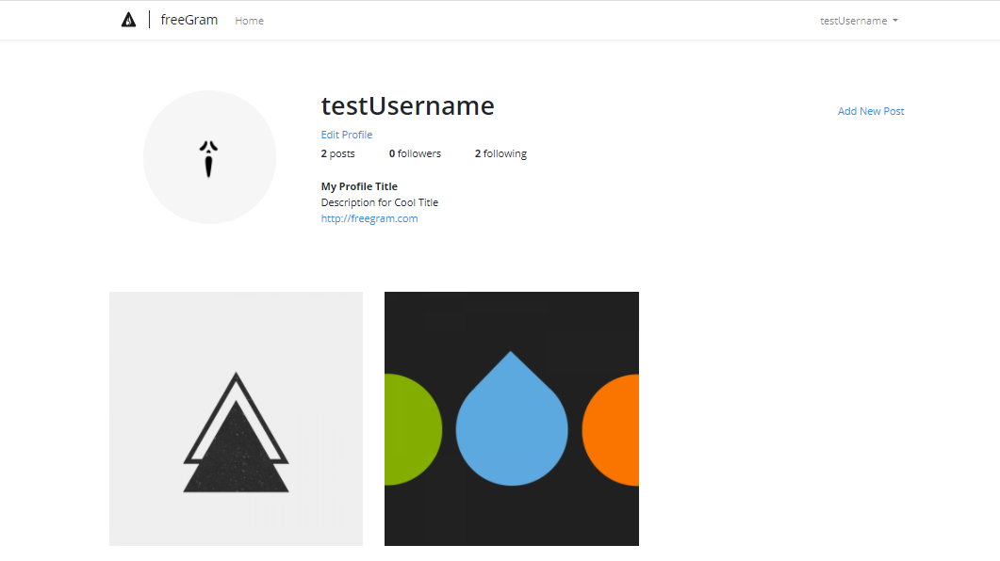

# insta_clone_laravel
Instagram clone using Laravel Framework

# Application Name
> freeGram

# Description
This is an Instagram clone using Laravel Framework.
Its fully working clone with the following functionality : 
  1. Login/SignUp
  2. Create Post
  3. Update Profile
  4. Follow/Unfollow
  5. Add Comments
  6. Welcome mail
  and etc.
  
 It uses SQLite databasse for backend.

# Different routes/pages

### Login Page
> 

### Register Page
> 

### Home Page
> 
>  Has all the posts with pagination in reverse chronological order

### Profile Page
> 
>  Consist of user details and _Edit and AddPost functionality_

### Post Page
> 
>  Page can show individual posts and user can give their individual comments

### Edit Profile Page
> 
>  Provide ability to change and update user details

### Add Post Page
> 

<!-- 
    
    
    
    
    
    
-->
